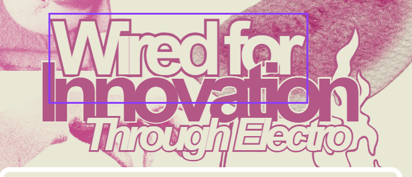
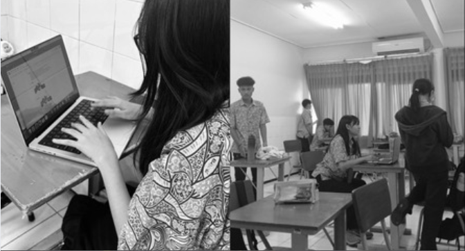
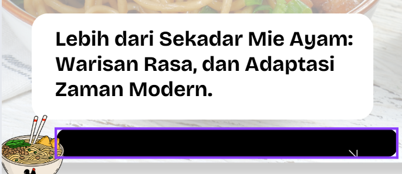
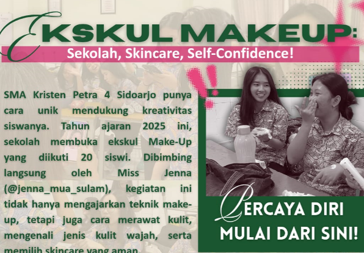

<html lang="id">
<head>
    <meta charset="UTF-8">
    <meta name="viewport" content="width=device-width, initial-scale=1.0">
    <title>BERITA TERKINI SMA PETRA 4 SIDOARJO</title>
    <!-- <link rel="stylesheet" href="bg.css"> -->
    <link rel="stylesheet" href="https://cdnjs.cloudflare.com/ajax/libs/font-awesome/6.0.0/css/all.min.css">
    
    
</head>
<body class="bg-gray-100">
    <!-- Header -->
    <header class="bg-white shadow-md sticky top-0 z-50">
        

            

                <!-- Logo Kiri (Icon + Judul + Logo Sekolah) -->
                

                    

                        <i class="fas fa-newspaper text-white text-xl"></i>
                    

                    <!-- Tambahan: Logo Sekolah di sebelah kiri atas (bisa diganti dengan path gambar asli) -->
                    
                    <h1 class="text-2xl font-bold text-gray-800">Berita Terkini</h1>
                

                <!-- Search, Mobile Menu, dan Logo Listing di Sebelah Atas Kanan -->
                

                    <!-- Search -->
                    

                        <i class="fas fa-search text-gray-500 mr-2"></i>
                        <input type="text" placeholder="Cari berita..." class="bg-transparent outline-none text-sm">
                    

                    <!-- Tambahan: Listing Logo di Sebelah Atas Kanan (misalnya list ikon atau logo tambahan; di sini saya buat sebagai logo sekolah alternatif atau ikon list) -->
                    

                        
                        OUR NEWS IN SMA PETRA 4
                    

                    <button class="md:hidden text-gray-700">
                        <i class="fas fa-bars text-xl"></i>
                    </button>
                

            

        

    </header>

    <!-- Breaking News Banner -->
    

        

            

                Berita Panas
                <marquee behavior="scroll" direction="left" class="text-sm">
                    Jurnalistik digital bersama tim jurnalistik SMA Petra 4 Sidoarjo
                </marquee>
            

        

    

    <!-- Hero Section -->
    <section id="home" class="gradient-bg text-white py-16">
        

            

                

                    FEATURED STORY
                    <h2 class="text-4xl md:text-5xl font-bold mb-6 leading-tight">
                        Wired for Innovation Throught Electro
                    </h2>
                    

                        Di balik ruang fisika yang penuh dengan untaian kabel, transistor, dan resistor sekelompok siswa sibuk merakit alat alat rusak. 

                        Mereka adalah bagian dari ELS Elektro, sebuah kelas yang bukan hanya mengajarkan sebuah teori tetapi juga keterampilan hidup yang berguna. Menurut mereka, yang merupakan bagian dari ELS Elektro merasa bahwa elektro bukanlah sesuatu hal yang cukup mudah untuk dilakukan.

                        Retha, salah satu siswa ELS Elektro berkata, "Di elektro saat kerjain tugas harus bisa fokus, presisi sama sabar."
                    

                    

                        

                            <i class="far fa-calendar-alt mr-2"></i>
                            26 Agustus 2025
                        

                        

                            <i class="far fa-clock mr-2"></i>
                            info terkini
                        

                    

                    <a href="https://share.google/5ts2tjQrj9KSaK2fw" class="bg-white text-purple-600 px-8 py-3 rounded-lg font-semibold hover:bg-gray-100 transition duration-300">
                        Baca Selengkapnya
                    </a>
                

                

                    
                    

                        

                            

                                
                            

                            

                                

                                
Senior Tech Journalist

                            

                        

                    

                

            

        

    </section>

    <!-- New Live Streaming Section (Ditambahkan di atas section berita) -->
    <section id="live" class="py-16 bg-white">
        

            

                <h2 class="text-3xl font-bold text-gray-800 mb-4">Live Streaming</h2>
                
Tonton siaran langsung acara sekolah dan kegiatan terkini dari SMA Petra 4 Sidoarjo.

            

            

                

                    <!-- Indikator Live -->
                    

                        <i class="fas fa-circle mr-1"></i>LIVE
                    

                    <!-- Embed YouTube Live Stream (Ganti dengan URL live stream Anda, misalnya dari YouTube) -->
                    <!-- Contoh: Jika menggunakan YouTube, gunakan format embed seperti ini. Pastikan video adalah live stream. -->
                    <iframe 
                        src="https://www.youtube.com/embed/LIVE_STREAM_ID?autoplay=1&mute=0" 
                        allowfullscreen 
                        allow="accelerometer; autoplay; clipboard-write; encrypted-media; gyroscope; picture-in-picture; web-share"
                        title="Live Streaming SMA Petra 4 Sidoarjo">
                    </iframe>
                    <!-- Alternatif jika menggunakan Twitch: -->
                    <!-- <iframe src="https://player.twitch.tv/?channel=YOUR_CHANNEL&parent=yourdomain.com" frameborder="0" allowfullscreen="true" scrolling="no" height="400"></iframe> -->
                    <!-- Catatan: Ganti LIVE_STREAM_ID dengan ID video live YouTube Anda (dari URL seperti https://www.youtube.com/watch?v=LIVE_STREAM_ID). Untuk live stream, gunakan fitur embed YouTube Live. -->
                

                

                    
Tidak ada siaran saat ini? Cek jadwal acara di Instagram kami!

                    <a href="https://www.instagram.com/digicomtrapat/" class="inline-block mt-4 bg-purple-600 text-white px-6 py-2 rounded-lg font-semibold hover:bg-purple-700 transition duration-300">
                        <i class="fab fa-instagram mr-2"></i>Lihat Jadwal
                    </a>
                

            

        

    </section>

    <section id="news" class="py-16 bg-gray-50">
        

            

                <h2 class="text-3xl font-bold text-gray-800 mb-4">Berita Terbaru</h2>
                
Update Berita SMA Trafour

            

            

                <!-- News Card 1: ELS Desain Grafis -->
                

                    

                        
                        ELS DESAIN GRAFIS
                    

                    

                        <h3 class="font-bold text-lg mb-3 text-gray-800">Menembus Batas Kreativitas</h3>
                        
Suasana di kelas ELS Desain Grafis tidak selalu kaku. Ada yang serius mengutak-atik desain, ada pula yang sesekali bermain game. Namun, justru dalam atmosfer santai itulah kreativitas siswa semakin tumbuh.

                        Kathleen adalah salah satunya. Ia senang bisa merancang CV dengan gaya abstrak yang berbeda dari kebanyakan. “CV saya memang tidak terlalu terstruktur, tapi itu justru ciri khas saya,” katanya. Baginya, materi logo menjadi yang paling berkesan karena sudah terbiasa membuat sketsa sejak awal. Lebih dari sekadar tugas, ia bermimpi menjadikan karya-karyanya sebagai pintu menuju dunia wirausaha.

                        Abby juga punya cerita seru. Bersama timnya, ia melahirkan sebuah brand bernama Maison Étoile—yang berarti toko di galaksi, bagaikan berlian di antara bintang. “Membuat logo itu menyenangkan, karena di situ kami bisa benar-benar menyalurkan kreativitas dan membangun identitas brand sendiri,” jelasnya. Rencananya, produk perdana mereka berupa merchandise akan diluncurkan pada bulan bahasa.

                        Sementara itu, Davin menilai pengalaman ini lebih dari sekadar belajar teknik. “Kami diajarkan untuk berani keluar dari pola yang biasa, jadi karya seperti logo atau CV bisa bermanfaat, bahkan dijual,” ujarnya.

                        Dari CV hingga logo, dari ide hingga brand, para siswa membuktikan bahwa ruang kelas bisa menjadi laboratorium kreativitas. Di sinilah mereka tidak hanya belajar desain, tetapi juga belajar bermimpi lebih besar: menyiapkan masa depan dengan karya.
                        

                        

                            23 Sept 2025
                            <a href="https://share.google/5ts2tjQrj9KSaK2fw" class="text-blue-600 hover:text-blue-800 text-sm font-semibold">
                                →
                            </a>
                        

                    

                

                <!-- News Card 2: ELS Cooking (Diperbaiki struktur) -->
                

                    

                        
                        ELS COOKING
                    

                    

                        <h3 class="font-bold text-lg mb-3 text-gray-800">Inovasi Mi Ayam ala Siswa ELS Cooking</h3>
                        
Memodifikasi resep secara mandiri untuk menemukan cita rasa yang menurut mereka paling pas di lidah. Inovasi ini membuat sajian mereka terasa unik dibandingkan kuliner sejenis. Bahan utama diperoleh dari persediaan rumah dan pasar tradisional. Meski belum ada cerita khusus di balik sumber lokalnya, mereka tetap menjaga kualitas agar rasa tetap konsisten.

                        Menurut mereka, mi ayam sendiri sudah lama menjadi kuliner khas Indonesia. Perubahan zaman terutama terlihat pada teknik memasak. Dengan hadirnya teknologi baru, proses penyajian kini bisa lebih cepat dan efisien tanpa mengurangi cita rasa.

                        Ketika ditanya siapa yang berperan menjaga keaslian rasa, mereka menegaskan bahwa sosok pewaris resep adalah kunci utama. Warisan inilah yang membuat hidangan tetap otentik. Lebih dari sekadar makanan, mi ayam dianggap penting karena menjadi simbol keanekaragaman rempah di Indonesia. Dari satu mangkuk sederhana, tersimpan identitas budaya dan sejarah panjang kuliner Nusantara.

                        Menariknya, kelompok Jifon juga berusaha menyesuaikan diri dengan tren modern, seperti makanan sehat, vegetarian, hingga digitalisasi pemasaran. Caranya bukan dengan mengubah rasa secara total, melainkan meleburkan tren baru ke dalam resep tanpa menghilangkan ciri khas aslinya.

                        Sungguh, seporsi mi ayam ala Jifon bukan hanya soal rasa, tetapi juga kisah tentang tradisi, inovasi, dan identitas budaya Indonesia.
                        

                        

                            15 Oktober 2025
                            <a href="https://share.google/5ts2tjQrj9KSaK2fw" class="text-blue-600 hover:text-blue-800 text-sm font-semibold">
                                →
                            </a>
                        

                    

                

                <!-- News Card 3: ELS Makeup (Diperbaiki struktur) -->
                

                    

                        
                        ELS MAKEUP
                    

                    

                        <h3 class="font-bold text-lg mb-3 text-gray-800">EKSKUL MAKEUP: Sekolah, Skincare, Self-Confidence!</h3>
                        
SMA Kristen Petra 4 Sidoarjo punya cara unik mendukung kreativitas siswanya. Tahun ajaran 2025 ini, sekolah membuka ekskul Make-Up yang diikuti
